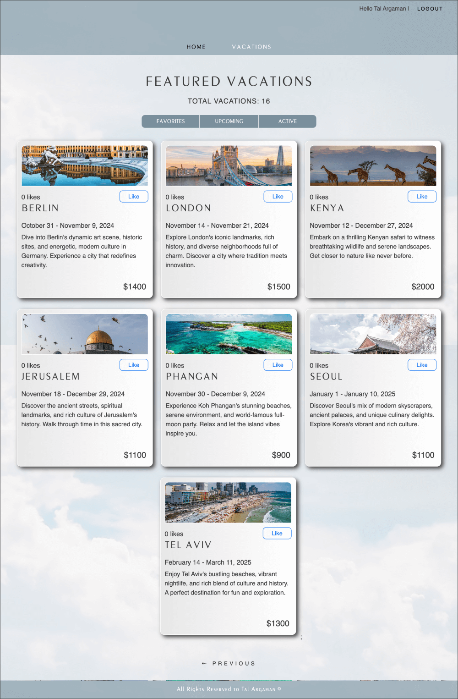

## Vacation Provocation (Frontend)

This is a Frontend-only version. The full-stack version is also available on GitHub for those interested in a comprehensive experience.
Sign up for the app to explore a variety of vacation options. Once registered, you can sort through vacations, highlight your favorites, and view upcoming trips. 
  
**Git Page:** 
 https://toulouse6.github.io/vacation-prov-frontend/
 
**Full-Stack Repository Page:**
 
https://github.com/Toulouse6/vacation-provocation-full-stack

**User Credentials:**
- **Email:** tal.argamanbib@gmail.com
- **Password:** argaman

**Admin Credentials:**
- **Email:** meetollie@gmail.com
- **Password:** 1234

---

**Technologies Used:**

- **React JS**
- **TypeScript**
- **CSS3**
- **HTML5**

- **Redux**
- **Notify**
- **Canvas JS**

**Author: Tal Argaman**
